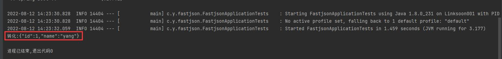

# springboot-fastjson

springboot+fastjson整合应用

> 参考: [https://blog.csdn.net/m0_46635265/article/details/123078087](https://blog.csdn.net/m0_46635265/article/details/123078087)

## fastjson

fastjson 是一个java语言编写的高性能且功能完善的JSON库，它采用一种“假定有序快速匹配”的算法，把JSON Parse 的性能提升到了极致

## 使用

- 添加依赖

```
<dependency>
    <groupId>org.springframework.boot</groupId>
    <artifactId>spring-boot-starter-web</artifactId>
    <exclusions>
        <exclusion>
            <groupId>org.springframework.boot</groupId>
            <artifactId>spring-boot-starter-json</artifactId>
        </exclusion>
    </exclusions>
</dependency>
<!-- json -->
<dependency>
    <groupId>com.alibaba</groupId>
    <artifactId>fastjson</artifactId>
    <version>1.2.83</version>
</dependency>
```

- 测试

```
@Test
void contextLoads() {
    System.out.println("转化:" + JSON.toJSONString(new TestUser(1, "yang")));
}
```

结果：



## 常用api

```
public static final Object parse(String text); // 把JSON文本parse为JSONObject或者JSONArray

public static final JSONObject parseObject(String text)； // 把JSON文本parse成JSONObject 
    
public static final <T> T parseObject(String text, Class<T> clazz); // 把JSON文本parse为JavaBean 

public static final JSONArray parseArray(String text); // 把JSON文本parse成JSONArray 

public static final <T> List<T> parseArray(String text, Class<T> clazz); //把JSON文本parse成JavaBean集合 

public static final String toJSONString(Object object); // 将JavaBean序列化为JSON文本 

public static final String toJSONString(Object object, boolean prettyFormat); // 将JavaBean序列化为带格式的JSON文本 

public static final Object toJSON(Object javaObject); //将JavaBean转换为JSONObject或者JSONArray
```